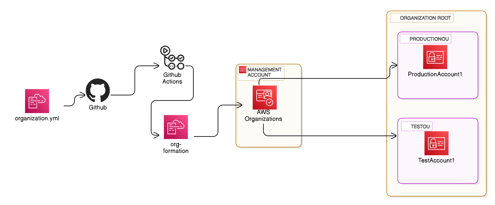

# AWS Organizations via org-formation

This repository contains information and resources related to AWS Organizations utilising [org-formation](https://github.com/org-formation/org-formation-cli).

## Overview

AWS Organizations is a service that helps you centrally manage and govern your environment as you grow and scale your AWS resources. With `org-formation`, you can create accounts, organize them in hierarchies, apply policies, and automate account creation and management. 

## Features

- **Centralized Management**: Manage multiple AWS accounts centrally via `organization.yml`
- **Policy-Based Control**: Apply policies to accounts or groups of accounts.
- **Automated Account Creation**: Automate the creation and management of AWS accounts via a workflow pipeline: `deployment-organizations.yml`
- **Consolidated Billing**: Combine billing for multiple accounts.
- **Automated Account Management**: When `organization.yml` is pushed to master a workflow pipeline will trigger to automate the deployment process.
- **Sample Org-formation Automated Deployment**:
    - [deployment #1](https://github.com/araxia55/aws-organizations/actions/runs/12660852517/job/35282889105)

## Prerequisite
1. Clone this repository.
2. Install [`aws-cli`](https://docs.aws.amazon.com/cli/latest/userguide/getting-started-install.html).
3. Create an administrator account in the console (don't use your *root* account).
   - Grant `AdministratorAccess` Policy
4. Setup `aws configure` with the Administrator keys.
5. Install `org-formation`.
- `npm install -g aws-organization-formation`

## Quick Start Guide

To get started with AWS Organizations utilising `org-formation`, follow these steps:

1. **Create an Organization**: Set up your organization in the `aws-cli` (This can also be performed via the AWS console).
    - run `aws organizations create-organization --feature-set ALL`
2. **List Accounts**: Check the structure of existing accounts.
    - `aws organizations list-roots`
    - `aws organizations list-accounts`
3. **Initialise org-formation**: 
    - `cd aws-organizations && org-formation init organization.yml`
4. **Validate Accounts**: You may need to check the verification email sent by AWS to the email address indicated as your management account this can be found in the `organization.yml` file.
5. **Organize and Add Accounts in OU (*Organizationl Unit*)**: Add existing accounts or create new ones. 
    - In your code editor include additional OU's and accounts by modifying the structure of the `organization.yml`.
    - Great resource to get the [org-formation grips](https://dev.to/oconijn/off-to-a-great-start-with-aws-organizations-1i74) started.
    <code>
        &nbsp;
        AWSTemplateFormatVersion: '2010-09-09-OC'
        Description: default template generated for organization with master account 897722709367
        &nbsp;
        Organization:
        ManagementAccount:
            Type: OC::ORG::MasterAccount
            Properties:
            AccountName: ganbatte
            AccountId: '******'
            RootEmail: ${{ secrets.ROOT_EMAIL }}
        &nbsp;
        OrganizationRoot:
            Type: OC::ORG::OrganizationRoot
            Properties:
            DefaultOrganizationAccessRoleName: OrganizationAccountAccessRole
        &nbsp;
        ProductionOU:
            Type: OC::ORG::OrganizationalUnit
            Properties:
            OrganizationalUnitName: production
            Accounts: 
                - Ref: ProductionAccount1
        &nbsp;
        TestOU:
            Type: OC::ORG::OrganizationalUnit
            Properties:
            OrganizationalUnitName: test
            Accounts: 
                - Ref: TestAccount1
        &nbsp;
        TestAccount1:
            Type: OC::ORG::Account
            Properties:
            Alias: test-account-1-5577CC
            AccountName: Test Account 1
            RootEmail: smash.daybreak112@passinbox.com
        &nbsp;    
        ProductionAccount1:
            Type: OC::ORG::Account
            Properties:
            Alias: prod-account-1-5577CC
            AccountName: Production Account 1
            RootEmail: koriyo.schnapps525@passinbox.com
    </code>
    
5. **Hide PII (*Personal Identifiable Information*)**: 
- Use Github Secrets to hide the root email as we don't like spam.
- Use an email alias service so all the `RootEmail` specified are just an alias to the real account.

## Documentation
- Checkout my blog post [here](https://www.raymund.cloud/post/org-formation/).
- For detailed documentation, visit the [AWS Organizations Documentation](https://docs.aws.amazon.com/organizations/).
- Awesome AWS three-part [blog](https://aws.amazon.com/blogs/opensource/managing-aws-organizations-using-the-open-source-org-formation-tool-part-1/) on `org-formation`.